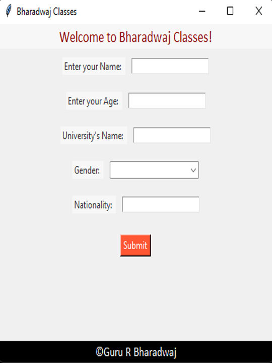
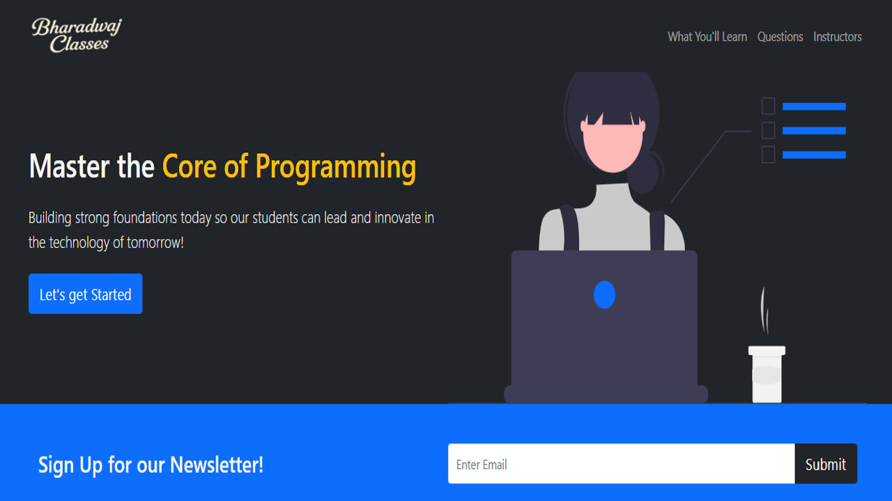

# Bharadwaj Classes
This repository presents a hybrid educational management system featuring both a **Tkinter-based Python GUI** and a **fully responsive Bootstrap-powered front-end website**. Built for the fictional "Bharadwaj Classes", it offers a complete student experience - from registration to course enrollment and payments, via both desktop software and modern web interface.

---

## 🚀 Features

- Developed a robust **Tkinter GUI** application for login, registration, course selection, and payment with a QR-based confirmation system.
- Created a parallel **Bootstrap website** with fully responsive layout, smooth navigation, newsletter, instructor cards, FAQ accordion, Google Form integration, and Leaflet-based live map display.
- Incorporated realistic content structure mimicking real-world educational platforms, offering three learning modes—Virtual, Hybrid, and In-Person—with pricing and benefits.

---

## ✅ Important Takeaways

- Practiced full-stack design by converting a Python GUI into an aesthetic, interactive website using **HTML, CSS, Bootstrap 5, and JS**.
- Learned responsive UI principles, modal forms, embedded Google Forms, font icons (Bootstrap Icons), accordion behaviors, and map APIs.
- Gained experience in aligning front-end design with back-end logic by visually replicating the original Python GUI workflow on the web.

---

## 📂 Project Overview

<table>
  <tr>
    <td align="center" width="350">
       
      <strong>Tkinter GUI Platform</strong> 
      
A Python Tkinter-based desktop app for user login, course selection, and QR code payment.

    </td>
   <td align="center" width="250" rowspan="2">
       
      <strong style="color: white; background-color: #333; padding: 4px 8px; display: inline-block;">GUI Preview</strong>
   </td>
    <td align="center" width="450" rowspan="2">
       
      <strong style="color: white; background-color: #333; padding: 4px 8px; display: inline-block;">WebPage Preview</strong>  
    </td>
  </tr>
  <tr>
    <td align="center" width="350">
       
      <strong>Bootstrap Webpage</strong> 
      
A responsive website using Bootstrap replicating the GUI app for browser-based access.

    </td>
  </tr>
</table>

---

## 🛠️ Setup Instructions

### 🔹 For GUI Version
1. Clone this repository  
2. Navigate to the Tkinter project directory  
3. Run `main.py` using any Python IDE or terminal with Python 3 installed  
4. Make sure image files and assets are in the correct relative paths  

### 🔹 For Web Version
1. Navigate to the website folder  
2. Open `index.html` in your preferred browser  
3. No server or installation required  
4. Ensure `img/` directory and `style.css` are correctly linked  

---

## 📌 Disclaimer

This dual-version educational management system was developed by me for academic and portfolio purposes. **Redistributing or presenting this project as your own is strictly prohibited.** Educational branding and design ideas are purely fictional and inspired by modern e-learning platforms.
